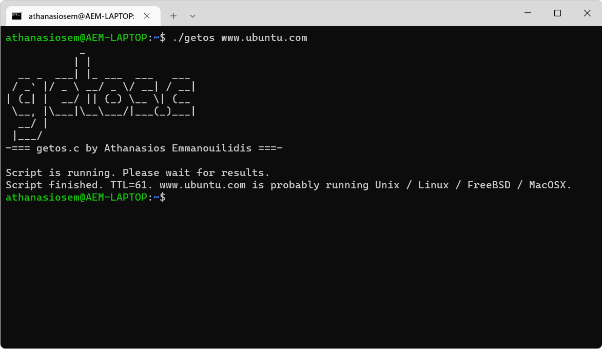

<h1 align="center">
  <br>
  <a href="https://github.com/athanasiosem/getos.c">
  getos.c
  </a>
</h1>

<h4 align="center">OS fingerprinting tool. Tries to guess OS by using the default TTL reply of ping.</h4>

</a>

<p align="center">
<a href="https://github.com/athanasiosem/getos.c/releases">
<a href="https://github.com/athanasiosem/getos.c/blob/main/LICENSE"></a>
<a href="https://github.com/athanasiosem/getos.c/issues"></a>
<a href="https://github.com/athanasiosem/getos.c/releases">

</p>

<p align="center">
  <a href="#features">Features</a> •
  <a href="#installation">Installation</a> •
  <a href="#usage">Usage</a>
</p>

# Features

getos.c is a script that tries to fingerprint the operating system of a remote host using the default TTL reply of ping.
The results are valid only if default TTL value has not been changed. Use at your own risk.

# Installation

You can compile getos.c using GCC by running the following command:

```sh
gcc getos.c -o getos
```

# Usage

You can run getos.c by running the following command:

```sh
./getos www.example.com
```

<div align="center">
Athanasios Emmanouilidis - 2023 - MIT License
</div>
