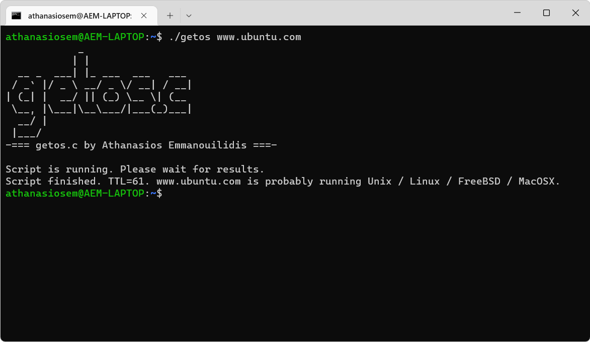

<h1 align="center">
  <br>
  <a href="https://github.com/athanasiosem/getos.c">
  getos.c
  </a>
</h1>

<h4 align="center">Open Source OS fingerprinting tool. Tries to guess OS by using the default TTL reply of ping.</h4>

</a>

<p align="center">
<a href="https://github.com/athanasiosem/getos.c/blob/main/LICENSE"></a>
<a href="https://github.com/athanasiosem/getos.c/issues"></a>
<a href="https://github.com/athanasiosem/getos.c/releases">
</p>

<p align="center">
  <a href="#features">Features</a> •
  <a href="#dependencies">Dependencies</a> •
  <a href="#installation">Installation</a> •
  <a href="#usage">Usage</a> •
  <a href="#testing">Testing</a> •
  <a href="#security">Security</a>
</p>

# Features

getos.c is an Open Source tool that tries to fingerprint the operating system of a remote host using the default TTL reply of ping. It combines the observed TTL with the hop count from traceroute to reconstruct the original TTL, then matches it against known defaults.

The results are valid only if the remote host has not changed its default TTL value. Use at your own risk.

**Detected OS families:**

| TTL | OS |
|-----|-----|
| 32  | Windows 95 / 98 / ME |
| 64  | Unix / Linux / FreeBSD / macOS |
| 128 | Windows Vista / 7 / 10 / 11 / Server 2008 |
| 255 | Solaris / AIX / Cisco |

# Dependencies

Requires `ping` and `traceroute` to be installed and available on `$PATH`.

```sh
# Debian / Ubuntu
sudo apt install iputils-ping traceroute

# Arch
sudo pacman -S inetutils traceroute

# macOS (ping built-in, traceroute built-in)
```

# Installation

Compile with GCC:

```sh
gcc getos.c -o getos
```

# Usage

```sh
./getos www.example.com
./getos 192.168.1.1
```

Example output:

```
Observed TTL: 54  Hops: 10  Reconstructed TTL: 64
Script finished. google.com is probably running Unix / Linux / FreeBSD / MacOSX.
```

# Testing

Build and run the unit tests:

```sh
gcc -DTESTING test_getos.c -o test_getos && ./test_getos
```

Tests cover `is_valid_host`, `find_executable`, `getClosest`, and `findClosest`.

# Security

- Input is validated against an allowlist of characters valid in hostnames and IP addresses before being passed to the shell. Shell metacharacters are rejected.
- Dependencies are located by searching `$PATH` at runtime rather than hardcoded paths.
- **Do not install this binary setuid.** Running it as a normal user requires no elevated privileges.

<div align="center">
Athanasios Emmanouilidis - MIT License
</div>
